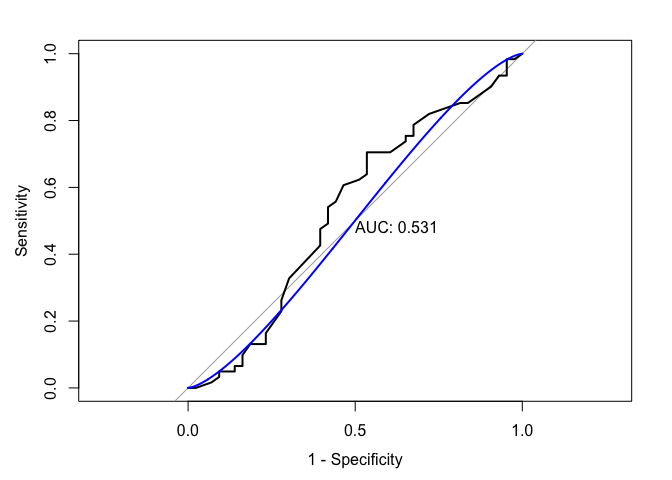
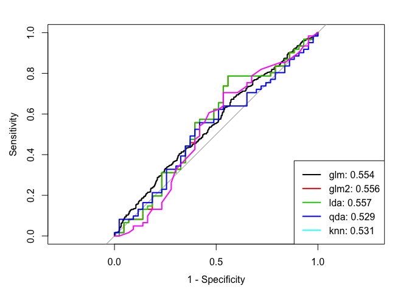

P8106\_hw3\_xh2395
================
Xin He
4/12/2020

## Homework 3 Description

This questions will be answered using the Weekly data set, which is part
of the ISLR package. This data is similar in nature to the Smarket data
on the textbook (ISL, Chapter 4.6) except that it contains 1,089 weekly
returns for 21 years, from the beginning of 1990 to the end of 2010. A
description of the data can be found by typing ?Weekly in the Console.
(Note that the column Today is not a predictor.)

## Set random seed

``` r
set.seed(2020)
```

## Import the data

``` r
library(ISLR)
data("Weekly")
```

## a) Produce some graphical summaries of the Weekly data

``` r
summary(Weekly)
```

    ##       Year           Lag1               Lag2               Lag3         
    ##  Min.   :1990   Min.   :-18.1950   Min.   :-18.1950   Min.   :-18.1950  
    ##  1st Qu.:1995   1st Qu.: -1.1540   1st Qu.: -1.1540   1st Qu.: -1.1580  
    ##  Median :2000   Median :  0.2410   Median :  0.2410   Median :  0.2410  
    ##  Mean   :2000   Mean   :  0.1506   Mean   :  0.1511   Mean   :  0.1472  
    ##  3rd Qu.:2005   3rd Qu.:  1.4050   3rd Qu.:  1.4090   3rd Qu.:  1.4090  
    ##  Max.   :2010   Max.   : 12.0260   Max.   : 12.0260   Max.   : 12.0260  
    ##       Lag4               Lag5              Volume       
    ##  Min.   :-18.1950   Min.   :-18.1950   Min.   :0.08747  
    ##  1st Qu.: -1.1580   1st Qu.: -1.1660   1st Qu.:0.33202  
    ##  Median :  0.2380   Median :  0.2340   Median :1.00268  
    ##  Mean   :  0.1458   Mean   :  0.1399   Mean   :1.57462  
    ##  3rd Qu.:  1.4090   3rd Qu.:  1.4050   3rd Qu.:2.05373  
    ##  Max.   : 12.0260   Max.   : 12.0260   Max.   :9.32821  
    ##      Today          Direction 
    ##  Min.   :-18.1950   Down:484  
    ##  1st Qu.: -1.1540   Up  :605  
    ##  Median :  0.2410             
    ##  Mean   :  0.1499             
    ##  3rd Qu.:  1.4050             
    ##  Max.   : 12.0260

The dataset contains 1089 observations and 9 variables.

``` r
theme1 = transparentTheme(trans = .4)
theme1$strip.background$col = rgb(.0, .6, .2, .2)
trellis.par.set(theme1)

featurePlot(x = Weekly[, 1:8],
            y = Weekly$Direction,
            scales = list(x = list(relation = "free"), y = list(relation = "free")),
            plot = "density", 
            pch = "|",
            auto.key = list(columns = 2))
```

<!-- -->

The response variable is Direction. The predictors are the five Lag
variables plus Volume. Among the 6 predictors, only the distribution of
variable Volume has a little difference between “Down” and “Up”
directions. There is almost no difference between “Down” and “Up”
directions for the distribution of other 5 variables.

## b) Logistic regression

Use the full data set to perform a logistic regression with Direction as
the response and the five Lag variables plus Volume as predictors. Do
any of the predictors appear to be statistically significant? If so,
which ones?

### Fit logistic regression model

``` r
glm_fit = glm(Direction~.,
              data = Weekly[c(-1, -8)],
              family = binomial)

contrasts(Weekly$Direction)
```

    ##      Up
    ## Down  0
    ## Up    1

### Summary

``` r
summary(glm_fit)
```

    ## 
    ## Call:
    ## glm(formula = Direction ~ ., family = binomial, data = Weekly[c(-1, 
    ##     -8)])
    ## 
    ## Deviance Residuals: 
    ##     Min       1Q   Median       3Q      Max  
    ## -1.6949  -1.2565   0.9913   1.0849   1.4579  
    ## 
    ## Coefficients:
    ##             Estimate Std. Error z value Pr(>|z|)   
    ## (Intercept)  0.26686    0.08593   3.106   0.0019 **
    ## Lag1        -0.04127    0.02641  -1.563   0.1181   
    ## Lag2         0.05844    0.02686   2.175   0.0296 * 
    ## Lag3        -0.01606    0.02666  -0.602   0.5469   
    ## Lag4        -0.02779    0.02646  -1.050   0.2937   
    ## Lag5        -0.01447    0.02638  -0.549   0.5833   
    ## Volume      -0.02274    0.03690  -0.616   0.5377   
    ## ---
    ## Signif. codes:  0 '***' 0.001 '**' 0.01 '*' 0.05 '.' 0.1 ' ' 1
    ## 
    ## (Dispersion parameter for binomial family taken to be 1)
    ## 
    ##     Null deviance: 1496.2  on 1088  degrees of freedom
    ## Residual deviance: 1486.4  on 1082  degrees of freedom
    ## AIC: 1500.4
    ## 
    ## Number of Fisher Scoring iterations: 4

The predictor “Lag2” apears to be statistically significant (Pr = 0.0296
\<
0.05).

## c) Compute the confusion matrix and overall fraction of correct predictions. Briely explain what the confusion matrix is telling you.

### Bayes classifier (cutoff 0.5).

``` r
glm_pred_prob = predict(glm_fit, type = "response")
glm_pred = rep("Down", length(glm_pred_prob))
glm_pred[glm_pred_prob > 0.5] = "Up"
```

### Overall fraction of correct predictions

``` r
sum(glm_pred == Weekly$Direction)/length(glm_pred_prob)
```

    ## [1] 0.5610652

The overall fraction of correct predictions is 56.11%.

### The confusion matrix

``` r
confusionMatrix(data = as.factor(glm_pred),
                reference = Weekly$Direction,
                positive = "Up")
```

    ## Confusion Matrix and Statistics
    ## 
    ##           Reference
    ## Prediction Down  Up
    ##       Down   54  48
    ##       Up    430 557
    ##                                          
    ##                Accuracy : 0.5611         
    ##                  95% CI : (0.531, 0.5908)
    ##     No Information Rate : 0.5556         
    ##     P-Value [Acc > NIR] : 0.369          
    ##                                          
    ##                   Kappa : 0.035          
    ##                                          
    ##  Mcnemar's Test P-Value : <2e-16         
    ##                                          
    ##             Sensitivity : 0.9207         
    ##             Specificity : 0.1116         
    ##          Pos Pred Value : 0.5643         
    ##          Neg Pred Value : 0.5294         
    ##              Prevalence : 0.5556         
    ##          Detection Rate : 0.5115         
    ##    Detection Prevalence : 0.9063         
    ##       Balanced Accuracy : 0.5161         
    ##                                          
    ##        'Positive' Class : Up             
    ## 

The positive we defined is “Up”. The negative is “down”.

  - The accuracy (overall fraction of correct predictions) is 0.5611.
  - The kappa (the agreement between the preditive value and the true
    value) is 0.035, which is small.
  - The sensitivity (the proportion of actual “Up” that are correctly
    identified) is 92.07%
  - The specificity (the proportion of actual “Down” that are correctly
    identified) is 11.16%. This model does not have a good performance
    in identifying “Down”.
  - The PPV is 56.43% and NPV is
52.94%.

## d) Plot the ROC curve using the predicted probability from logistic regression and report the AUC

``` r
roc_glm = roc(as.factor(Weekly$Direction), glm_pred_prob)
plot(roc_glm, legacy.axes = TRUE, print.auc = TRUE)
plot(smooth(roc_glm), col = 4, add = TRUE)
```

<!-- -->

The AUC is
0.554

## e) Now fit the logistic regression model using a training data period from 1990 to 2008, with Lag1 and Lag2 as the predictors. Plot the ROC curve using the held out data (that is, the data from 2009 and 2010) and report the AUC

### Set train dataset and test dataset

``` r
train = Weekly %>% 
    filter(Year < 2009) %>% 
    dplyr::select(Lag1, Lag2, Direction)

test = Weekly %>% 
    filter(Year >= 2009) %>% 
    dplyr::select(Lag1, Lag2, Direction)
```

### Fit the new logistic regression model

``` r
glm_fit2 = glm(Direction ~ ., data = train,family = binomial)

contrasts(train$Direction)
```

    ##      Up
    ## Down  0
    ## Up    1

``` r
summary(glm_fit2)
```

    ## 
    ## Call:
    ## glm(formula = Direction ~ ., family = binomial, data = train)
    ## 
    ## Deviance Residuals: 
    ##     Min       1Q   Median       3Q      Max  
    ## -1.6149  -1.2565   0.9989   1.0875   1.5330  
    ## 
    ## Coefficients:
    ##             Estimate Std. Error z value Pr(>|z|)   
    ## (Intercept)  0.21109    0.06456   3.269  0.00108 **
    ## Lag1        -0.05421    0.02886  -1.878  0.06034 . 
    ## Lag2         0.05384    0.02905   1.854  0.06379 . 
    ## ---
    ## Signif. codes:  0 '***' 0.001 '**' 0.01 '*' 0.05 '.' 0.1 ' ' 1
    ## 
    ## (Dispersion parameter for binomial family taken to be 1)
    ## 
    ##     Null deviance: 1354.7  on 984  degrees of freedom
    ## Residual deviance: 1347.0  on 982  degrees of freedom
    ## AIC: 1353
    ## 
    ## Number of Fisher Scoring iterations: 4

### Plot the ROC using test data

``` r
glm_pred_prob2 = predict(glm_fit2, type = "response", newdata = test)

roc_glm2 = roc(test$Direction, glm_pred_prob2)

plot(roc_glm2, legacy.axes = TRUE, print.auc = TRUE)
plot(smooth(roc_glm2), col = 4, add = TRUE)
```

<!-- -->

The AUC is 0.556

## f) Repeat e) using LDA and QDA

### LDA

### Fit the LDA model

``` r
lda_fit = lda(Direction ~ ., data = train) 

plot(lda_fit)
```

<!-- -->

### Plot the ROC using test data

``` r
lda_pred = predict(lda_fit, newdata = test) 
head(lda_pred$posterior)
```

    ##        Down        Up
    ## 1 0.5602039 0.4397961
    ## 2 0.3079163 0.6920837
    ## 3 0.4458032 0.5541968
    ## 4 0.4785107 0.5214893
    ## 5 0.4657943 0.5342057
    ## 6 0.5262907 0.4737093

``` r
roc_lda = roc(test$Direction, lda_pred$posterior[,2], levels = c("Down", "Up"))
plot(roc_lda, legacy.axes = TRUE, print.auc = TRUE) 
plot(smooth(roc_lda), col = 4, add = TRUE)
```

<!-- -->

The AUC is 0.557

### QDA

### Fit the QDA model

``` r
qda_fit = qda(Direction ~ ., data = train) 
```

### Plot the ROC using test data

``` r
qda_pred = predict(qda_fit, newdata = test) 
head(qda_pred$posterior)
```

    ##        Down        Up
    ## 1 0.5436205 0.4563795
    ## 2 0.3528814 0.6471186
    ## 3 0.2227273 0.7772727
    ## 4 0.3483016 0.6516984
    ## 5 0.4598550 0.5401450
    ## 6 0.5119613 0.4880387

``` r
roc_qda = roc(test$Direction, qda_pred$posterior[,2], levels = c("Down", "Up"))
plot(roc_qda, legacy.axes = TRUE, print.auc = TRUE) 
plot(smooth(roc_qda), col = 4, add = TRUE)
```

<!-- -->

The AUC is 0.529

## g) Repeat (e) using KNN. Briefly discuss your results.

### Fit the KNN model

``` r
ctrl = trainControl(method = "repeatedcv",
                    repeats = 5,
                    summaryFunction = twoClassSummary,
                    classProbs = TRUE)

knn_fit = train(Direction ~ ., data = train,
                method = "knn",
                trControl = ctrl,
                preProcess = c("center","scale"), 
                metric = "ROC",
                tuneGrid = data.frame(k = seq(1, 500, by = 5)))
```

### Summary

``` r
knn_fit$bestTune
```

    ##      k
    ## 99 491

``` r
ggplot(knn_fit)
```

<!-- -->

### Plot the ROC using test data

``` r
knn_predict =  predict.train(knn_fit, newdata = test , type = "prob")
roc_knn = roc(test$Direction, knn_predict[,"Up"], levels = c("Down", "Up"))
plot(roc_knn, legacy.axes = TRUE, print.auc = TRUE)
plot(smooth(roc_knn), col = 4, add = TRUE)
```

<!-- -->

The AUC is
0.531

### Compare the results

``` r
auc = c(roc_glm$auc[1], roc_glm2$auc[1], roc_lda$auc[1], roc_qda$auc[1], roc_knn$auc[1])

plot(roc_glm, legacy.axes = TRUE)
plot(roc_glm2, col = 2, add = TRUE)
plot(roc_lda, col = 3, add = TRUE)
plot(roc_qda, col = 4, add = TRUE)
plot(roc_knn, col = 6, add = TRUE)
modelNames <- c("glm","glm2","lda","qda","knn")
legend("bottomright", legend = paste0(modelNames, ": ", round(auc,3)), col = 1:6, lwd = 2)
```

<!-- -->

According to the graphs and reported AUC using test data, we found that
none model predicts the data direction (all AUC are near 0.5). Among
these 5 models, LDA has a relatively better performance on this test
data by using AUC as a metric.
